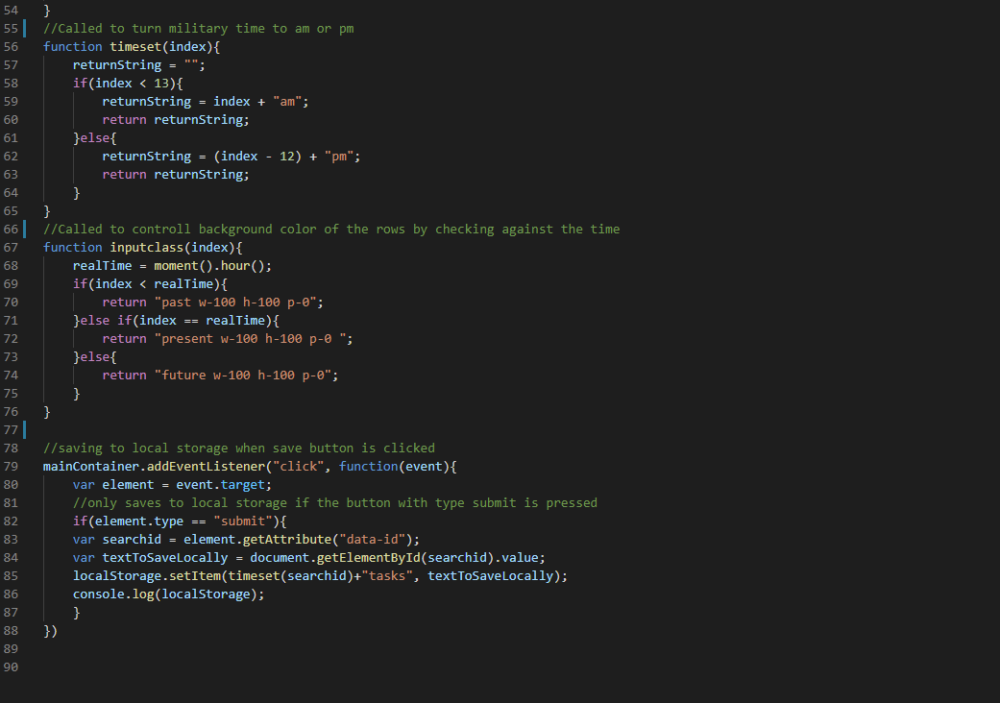

# Work Day Scheduler Aaron Ferguson
Deployed link: https://optical23.github.io/daySchedulerAaronF/

The way I completed this challenge was by first writing out what I needed in html and adding the bootstrap and knowing what I wanted before trying to build it dynamically

Once I got to the Script.js file I started with the simple display time which I just used the moment api for

Then I already knew the html I needed to dynamically generate my rows for the day scheduler and had a for loop iterate them

I call a few extra functions in the screen shots above to change military time and the index number to am or pm. Also to decide the background color of the input boxes to show if it is the current hour, past hour or future hour. As well as save to local storage so even when refreshed the tasks persist only if they were saved with the save/submit button.

